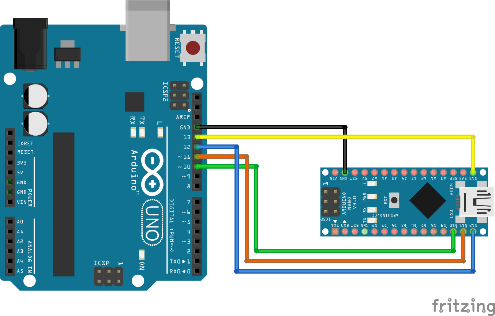

## [Arduino/Arduino SPI Communication](https://github.com/ArdooTala/BUS_SPI-Arduino.git)

#### Description
This is a sample of `Arduino` to `Arduino` communication through `SPI` method.

>[Serial Peripheral Interface (SPI) is an interface bus commonly used to send data between microcontrollers and small peripherals such as shift registers, sensors, and SD cards. It uses separate clock and data lines, along with a select line to choose the device you wish to talk to.](https://learn.sparkfun.com/tutorials/serial-peripheral-interface-spi/all "Learn.Sparkfun.com")

- ###### Advantages of SPI:
  - It’s faster than asynchronous serial
  - The receive hardware can be a simple shift register
  - It supports multiple slaves

- ###### Disadvantages of SPI:
  - It requires more signal lines (wires) than other communications methods
  - The communications must be well-defined in advance (you can’t send random amounts of data whenever you want)
  - The master must control all communications (slaves can’t talk directly to each other)
  - It usually requires separate SS lines to each slave, which can be problematic if numerous slaves are needed.

#### Circuit:

###### References:
To find out more about `SPI` please refer to:
- [Arduino.cc](https://www.arduino.cc/en/reference/SPI)
- [Sparkfun.com](https://learn.sparkfun.com/tutorials/serial-peripheral-interface-spi/all)

---

